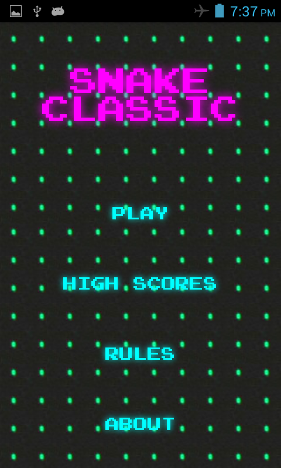
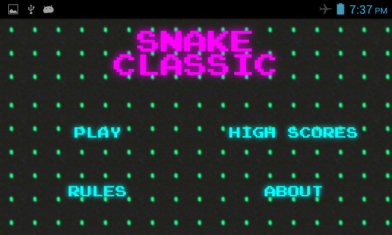
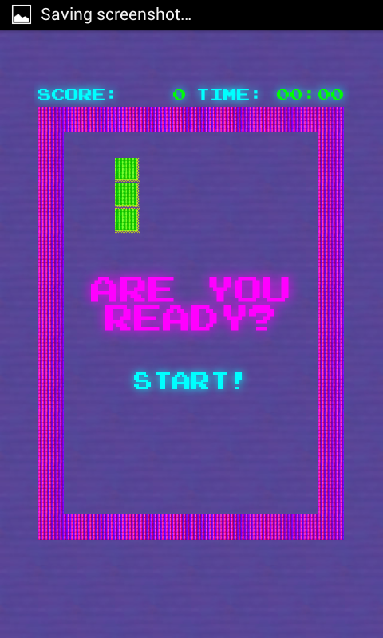
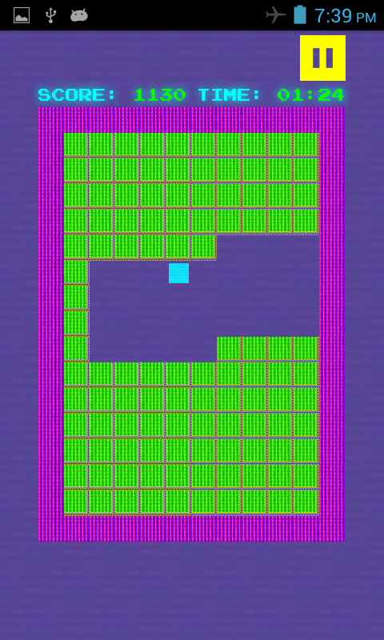
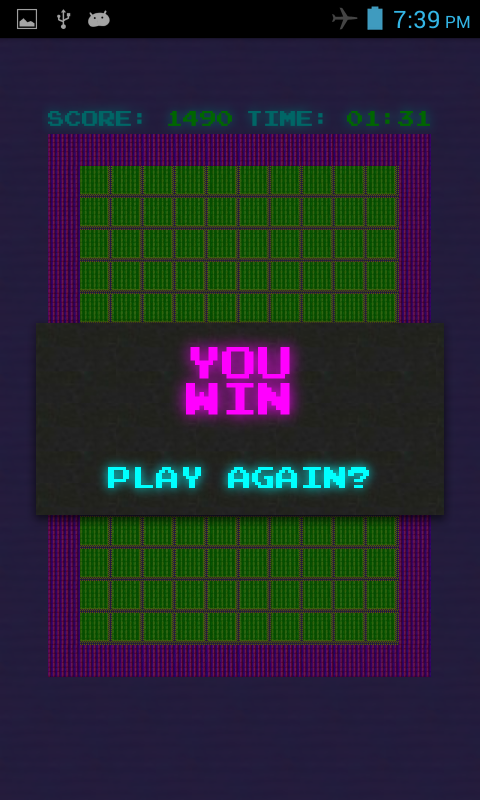
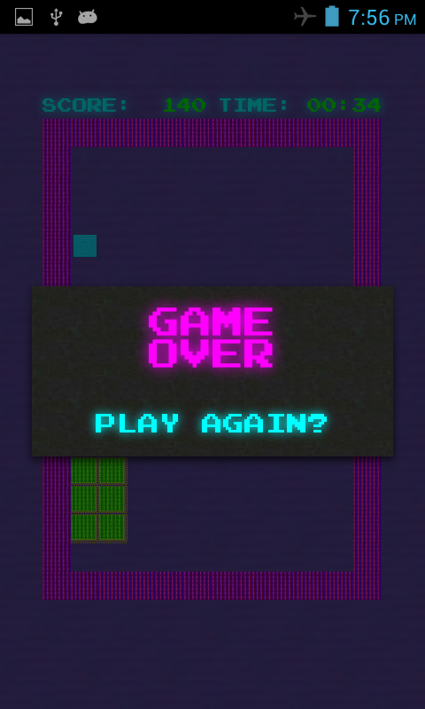
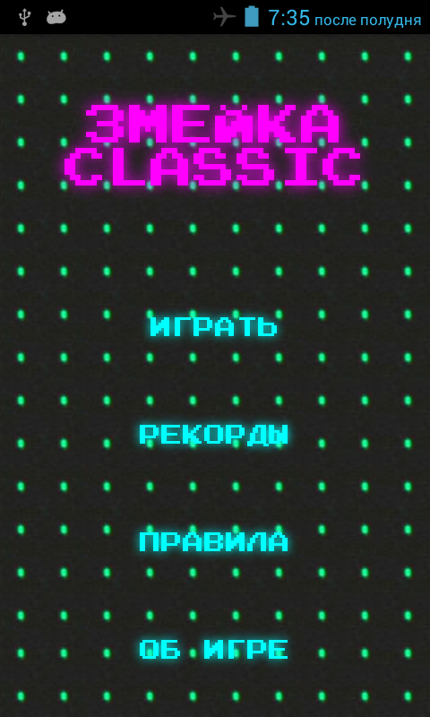
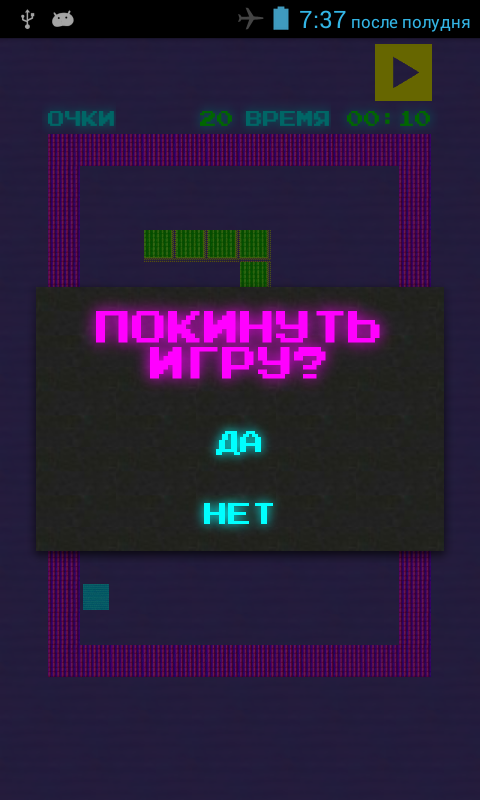

<h1>Snake Classic</h1>

It is an addictive and simple version of the snake game for Android.

<h3>Rules</h3>

Player is controlling a snake, which is crawling in a compound wall. There will be new fruits placed at different parts of the playing area and the strategy is to eat all of these while ensuring a smooth movement by the snake. The snake's movement should not be restricted by a wall or its own body. While starting to play the game, managing the movement of your snake is very easy but when your snake eats fruits, the snake's body becomes bigger and navigation of the snake is very difficult.

<h3>Some features</h3>

What is support the game?

<ul>
  <li>English and Russian languages</li>
  <li>Controlling the snake by directional swipe, that is you only need to swipe in the direction you want to turn your snake</li>
  <li>Partial support for landscape orientation (far only in the game's main menu)</li>
  <li>Classic video game font (designed by <a href="http://zone38.net/">codeman38</a>)</li>
  <li>And more :)</li>
</ul>
<h3>Screenshots</h3>
<h6>Game's menu</h6>
<table>
  <tr>
    <td></td>
    <td></td>
  </td>
</table>
<h6>Gameplay</h6>
<table>
  <tr>
    <td></td>
    <td></td>
  </td>
</table>
<h6>Game's dialogs</h6>
<table>
  <tr>
    <td></td>
    <td></td>
  </td>
</table>
<h6>Russian localization</h6>
<table>
  <tr>
    <td></td>
    <td></td>
  </td>
</table>